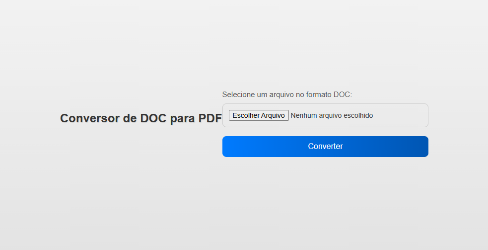

# Conversor de DOCX para PDF

📌 Sobre o projeto:

Este é um Conversor de DOCX para PDF desenvolvido com Flask (Python) no backend e uma interface simples em HTML, CSS e JavaScript no frontend. O usuário pode fazer upload de um arquivo DOCX, que será convertido para PDF e disponibilizado para download automaticamente.

🚀 Tecnologias Utilizadas:

-Python (Flask) - Para o backend e manipulação de arquivos
-docx2pdf - Biblioteca usada para conversão de DOCX para PDF
-HTML, CSS - Para a interface do usuário
-JavaScript (Fetch API) - Para envio do arquivo e download do PDF

🎯 Funcionalidades
✅ Upload de arquivos DOCX
✅ Conversão automática para PDF
✅ Download do arquivo convertido

📂 conversor-docx-pdf/
│── 📂 static/           # Pasta para arquivos CSS e JS
│── 📂 templates/        # HTML do projeto
│── 📂 uploads/          # Onde os arquivos enviados são armazenados
│── 📂 output/           # Onde os PDFs convertidos são armazenados
│── app.py              # Código principal do backend Flask
│── requirements.txt    # Lista de dependências do projeto
│── README.md           # Documentação do projeto

🛠 Como Rodar o Projeto

1️⃣ Clone este repositório
git clone https://github.com/seuusuario/conversor-docx-pdf.git
cd conversor-docx-pdf

2️⃣ Crie um ambiente virtual (opcional, mas recomendado)
python -m venv venv
source venv/bin/activate  # Linux/Mac
venv\Scripts\activate     # Windows

3️⃣ Instale as dependências
pip install -r requirements.txt

4️⃣ Execute o servidor
python app.py
O servidor Flask será iniciado e poderá ser acessado via http://127.0.0.1:5000.

🖼️ Interface
Aqui está uma prévia da interface do projeto:

📜 Licença
Este projeto está sob a licença MIT. Sinta-se à vontade para modificar e usar como quiser!
